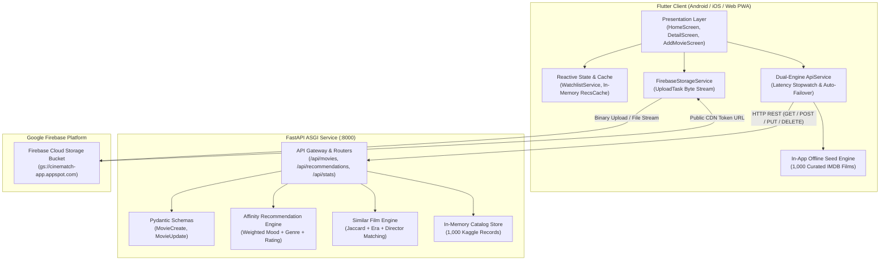

# CineMatch — Intelligent Movie Recommendation & Catalog Platform

[](https://flutter.dev)
[](https://dart.dev)
[](https://fastapi.tiangolo.com)
[](https://python.org)
[](https://firebase.google.com)
[](#-testing--quality-assurance)
[](#-testing--quality-assurance)
[](LICENSE)

> **Practical 12**: *Develop and Deploy a Complete Flutter Application with a Backend API and Cloud Storage.*  
> **CineMatch** is an enterprise-grade, content-aware movie recommendation and exploration platform featuring a high-performance **Flutter** frontend, an asynchronous **Python FastAPI** backend, and **Google Firebase Cloud Storage** for media uploads.

---

## 📑 Table of Contents

- [🌟 Advanced Features & Capabilities](#-advanced-features--capabilities)
- [🏗 System Architecture](#-system-architecture)
- [📊 Flowcharts & System Execution Paths](#-flowcharts--system-execution-paths)
- [🧮 Recommendation & Similarity Mathematics](#-recommendation--similarity-mathematics)
- [📁 Project Directory Structure](#-project-directory-structure)
- [📡 REST API Specification & cURL Examples](#-rest-api-specification--curl-examples)
- [🚀 Quick Start Guide](#-quick-start-guide)
  - [1. Backend Setup (FastAPI)](#1-backend-setup-fastapi)
  - [2. Frontend Setup (Flutter)](#2-frontend-setup-flutter)
  - [3. Firebase Cloud Storage Setup](#3-firebase-cloud-storage-setup)
- [🧪 Testing & Quality Assurance](#-testing--quality-assurance)
- [📦 Build & Release (Standalone APK)](#-build--release-standalone-apk)
- [🎓 Academic Attribution](#-academic-attribution)

---

## 🌟 Advanced Features & Capabilities

### ⚡ Dual-Engine High-Availability Architecture
- **Active-Active Failover**: Operates with a live Python FastAPI ASGI backend on `http://127.0.0.1:8000` and automatically switches to an in-app compiled Dart seed engine (`assets/data/movies_seed.json`) with **0ms latency** if the remote server is unreachable.
- **Real-Time Network Telemetry**: Includes a live round-trip latency stopwatch (`latency_ms`) displayed directly in the app bar and settings dashboard.

### 🧠 Intelligent Multi-Factor Recommendation Engines
- **Mood & Genre Affinity Engine**: Computes normalized affinity match percentages ($72\% - 99\%$) based on user mood categories (`Adrenaline`, `Mind-Bending`, `Suspense`, `Romantic`, etc.) and genre tags.
- **Multi-Attribute Similar Movies Engine**: Computes composite similarity using Jaccard genre overlap ($45\%$), director match ($20\%$), mood alignment ($15\%$), release era proximity ($10\%$), and rating proximity ($10\%$).
- **Transparent Score Breakdown**: Renders a radar score breakdown showing base score, mood bonus, genre bonus, and rating boost.

### 👥 Community Recommendations & Top-Rating Consensus
- **User Recommendation Engine**: Tracks real-time community recommendation counts (`userRecommendationsCount` & `recommendedByUsers`). Users can toggle recommendations on any title with live feedback.
- **Composite Top Rating Algorithm**: Synthesizes verified IMDb ratings ($60\%$), active community user ratings ($25\%$), and recommendation volume bonuses ($15\%$) into a single gold standard rating ($1.0 - 10.0$).
- **User Profile & Login State**: Persistent `AuthService` maintaining user identity (`@handle`, name, bio, email), personal ratings history, and recommended film badges synced across app sessions.
- **Top Community Sorting**: Direct filter in Catalog tab (`★ Top Rated (Community + IMDb)` and `🔥 Most Recommended`).

### ☁️ Cloud Media Ingestion with Firebase Storage
- **Direct Streaming Upload**: Camera and gallery integration via `image_picker` streaming bytes directly to Firebase Cloud Storage (`gs://cinematch-app.appspot.com/movie_posters/`).
- **Live Visual Progress**: Animated linear progress bar tracking real-time byte transfer percentages.
- **Public CDN Token Retrieval**: Fetches secure tokenized download URLs and bundles them into movie review creation payloads.

### 🔍 Advanced Exploration & Catalog Tools
- **Interactive Genre Filter Carousel**: One-tap genre switching (`All`, `Action`, `Sci-Fi`, `Drama`, `Comedy`, `Thriller`, etc.).
- **Debounced Instant Search**: Sub-millisecond search across title, director, cast, and storyline.
- **Multi-Parameter Sorting**: Sort by Top Rated (Community + IMDb), Most Recommended, IMDb rating, release year, or title.
- **Persistent Watchlist Vault**: Device-stored bookmark manager with `shared_preferences` persistence across app restarts, one-tap bookmark toggles, and a batch clear-all confirmation guard.
- **Surprise Pick Generator**: Instant random curated movie suggestion modal.
- **Clipboard Summary Sharing**: One-tap copy of movie metadata and synopsis with toast confirmation.
- **In-App Video Trailer Modal**: Streaming trailer dialog preview with playback controls.
- **Observability Dashboard**: Live catalog distribution analytics (total titles, average IMDB rating, top genres distribution, decade histogram).

### 🎨 Professional Gen Z Brand Identity
- **Futuristic CineMatch Emblem**: Custom-designed neon vermilion (`#E23D28`) and cyber amber camera aperture icon on a matte obsidian backdrop (`assets/images/app_logo.png`).
- **Omnipresent Deployment**: Embedded across the Flutter AppBar header, web favicon, instant pure CSS splash screen, and native Android launcher mipmaps.
- **Branded Watermark Fallback**: Enhances movie poster loading and error states with an authentic brand glyph watermark.

---

## 🏗 System Architecture

For in-depth architectural specifications and C4 models, see [architecture.md](architecture.md).



---

## 📊 Flowcharts & System Execution Paths

Detailed Mermaid flowcharts covering the end-to-end user navigation, failover tree, media upload stream, recommendation algorithms, and production deployment are documented in [flowchart.md](flowchart.md).

---

## 🧮 Recommendation & Similarity Mathematics

### 1. Content-Based Recommendation Affinity ($S_{norm}$)
$$S_{raw} = S_{base} + \Delta_{mood} + \Delta_{genre} + (Rating \times 2.0)$$

$$S_{norm} = \text{clamp}\left(\frac{S_{raw}}{142.0} \times 100.0, \, 72.0, \, 99.0\right)$$

- **$S_{base}$**: Inherent quality baseline derived from IMDB ranking ($80.0 - 98.0$).
- **$\Delta_{mood}$**: $+15.0$ bonus when the movie's mood matches the user's selected mood.
- **$\Delta_{genre}$**: $+10.0$ bonus when the movie's genre tags intersect the user's filter.
- **Rating Factor**: Proportional score bonus scaled by critic rating ($0.0 - 20.0$).

### 2. Multi-Attribute Similar Film Metric ($\text{Sim}$)
$$\text{Sim}(T, C) = 45 \cdot J(G_T, G_C) + 20 \cdot \delta(Dir) + 15 \cdot \delta(Mood) + 10 \cdot E(Year) + 10 \cdot P(Rating)$$

- **Genre Jaccard Index**: $J(G_T, G_C) = \frac{|G_T \cap G_C|}{|G_T \cup G_C|}$
- **Director Exact Match**: $\delta(Dir) = 1.0$ if director matches, else $0.0$.
- **Mood Alignment**: $\delta(Mood) = 1.0$ if mood aligns, else $0.0$.
- **Release Era Proximity**: $E(Year) = \max\left(0, 1.0 - \frac{|Year_T - Year_C|}{40}\right)$
- **Rating Proximity**: $P(Rating) = \max\left(0, 1.0 - \frac{|Rating_T - Rating_C|}{5}\right)$

---

## 📁 Project Directory Structure

```
wmaprac/
├── backend/
│   ├── data/
│   │   └── full_movies.json          # 1,000 Kaggle IMDB movie records
│   ├── main.py                       # FastAPI REST endpoints, CORS & analytics
│   ├── process_dataset.py            # Dataset cleaning & seed generator
│   └── requirements.txt              # Python dependencies
├── lib/
│   ├── models/
│   │   └── movie.dart                # Strongly-typed Movie entity & JSON serializer
│   ├── screens/
│   │   ├── add_movie_screen.dart     # Form to create movie & stream poster to Firebase
│   │   ├── home_screen.dart          # Multi-tab dashboard: Recommended, Catalog, Watchlist
│   │   ├── movie_detail_screen.dart  # Synopsis, trailer, copy, PUT edit, DELETE, similar
│   │   └── settings_screen.dart      # Server endpoint presets, latency test, analytics
│   ├── services/
│   │   ├── api_service.dart          # Dual-engine HTTP client with latency telemetry
│   │   ├── firebase_storage_service.dart # Cloud storage uploader & stream tracker
│   │   └── watchlist_service.dart    # Reactive in-memory bookmark manager
│   ├── theme/
│   │   └── app_theme.dart            # Obsidian & Vermilion design system tokens
│   ├── widgets/
│   │   ├── movie_card.dart           # Hover-animated movie poster card
│   │   ├── poster_image.dart         # Optimized image loader with monogram fallback
│   │   ├── previews.dart             # Rapid UI component previews
│   │   └── recommendation_chips.dart # Mood and genre selection carousel
│   ├── firebase_options.dart         # Firebase multi-platform configuration
│   └── main.dart                     # App entry point with concurrent startup
├── android/                          # Native Android runner (cine.match)
├── test/
│   └── widget_test.dart              # Automated unit and widget test suite
├── web/
│   └── index.html                    # Web container with pure CSS splash screen
├── assets/data/
│   └── movies_seed.json              # Packaged offline movie seed data
├── architecture.md                   # C4 model & architectural specification
├── flowchart.md                      # Complete system execution flowcharts
├── requirements.txt                  # Root Python requirements
└── pubspec.yaml                      # Flutter dependencies and assets declaration
```

---

## 📡 REST API Specification & cURL Examples

Interactive Swagger documentation is available at **`http://127.0.0.1:8000/docs`**.

| Method | Endpoint | Parameters | Description |
|---|---|---|---|
| `GET` | `/api/health` | — | Service health status, version, and movie count. |
| `GET` | `/api/stats` | — | Catalog analytics, mean rating, top genres, and decade histogram. |
| `GET` | `/api/genres` | — | List all unique genre tags available in the database. |
| `GET` | `/api/moods` | — | List all available mood classifications. |
| `GET` | `/api/movies` | `genre`, `search`, `min_rating`, `skip`, `limit` | Paginated catalog query with filtering and search. |
| `GET` | `/api/movies/{id}` | — | Fetch single movie details by unique ID. |
| `GET` | `/api/movies/{id}/similar` | `limit` | Ranked list of similar movies based on multi-attribute affinity. |
| `GET` | `/api/recommendations` | `mood`, `genre`, `limit` | Top recommended movies ranked by affinity score. |
| `POST` | `/api/movies` | *JSON Body* | Add a new movie record (`201 Created`). |
| `PUT` | `/api/movies/{id}` | *JSON Body (`rating`, `synopsis`)* | Update movie details (`200 OK`). |
| `DELETE` | `/api/movies/{id}` | — | Delete movie from database (`200 OK`). |
| `POST` | `/api/movies/reset` | — | Reset database back to original 1,000 Kaggle records. |

### Example cURL Queries

```bash
# 1. Health check with service statistics
curl -X GET http://127.0.0.1:8000/api/health

# 2. Get top 6 recommendations for Mind-Bending Sci-Fi
curl -X GET "http://127.0.0.1:8000/api/recommendations?mood=Mind-Bending&genre=Sci-Fi&limit=6"

# 3. Get multi-attribute similar movies for Inception (m_1)
curl -X GET "http://127.0.0.1:8000/api/movies/m_1/similar?limit=6"

# 4. Create a new movie with cloud poster URL
curl -X POST http://127.0.0.1:8000/api/movies \
  -H "Content-Type: application/json" \
  -d '{
    "title": "Dune: Part Two",
    "genre": "Action, Adventure, Sci-Fi",
    "mood": "Adrenaline",
    "director": "Denis Villeneuve",
    "actors": "Timothée Chalamet, Zendaya",
    "year": 2024,
    "runtime": 166,
    "rating": 8.6,
    "synopsis": "Paul Atreides unites with Chani and the Fremen while seeking revenge against the conspirators who destroyed his family.",
    "poster_url": "https://images.unsplash.com/photo-1534447677768-be436bb09401?w=800&q=80"
  }'
```

---

## 🚀 Quick Start Guide

### Prerequisites
- **Flutter SDK**: 3.22.0 or later ([flutter.dev](https://flutter.dev))
- **Python**: 3.10 or later ([python.org](https://python.org))
- **Google Chrome** (for web) or **Android Studio / Physical Device** (for Android)

---

### 1. Backend Setup (FastAPI)

1. Open a terminal in the project root:
   ```bash
   pip install -r requirements.txt
   ```
2. Start the FastAPI backend:
   ```bash
   uvicorn backend.main:app --host 127.0.0.1 --port 8000 --reload
   ```
3. Verify interactive Swagger documentation:
   - Interactive Docs: [http://127.0.0.1:8000/docs](http://127.0.0.1:8000/docs)
   - Health Endpoint: [http://127.0.0.1:8000/api/health](http://127.0.0.1:8000/api/health)

---

### 2. Frontend Setup (Flutter)

1. Install project dependencies:
   ```bash
   flutter pub get
   ```
2. Run on Google Chrome:
   ```bash
   flutter run -d chrome
   ```
3. Run on Android Emulator / Physical Device:
   ```bash
   flutter run -d android
   ```
   > **Note for Android Device / Emulator**: In the app's **Settings**, switch the server preset to `http://10.0.2.2:8000` (Android Emulator) or your computer's local Wi-Fi IP (physical device).

---

### 3. Firebase Cloud Storage Setup

1. Create a Firebase project in the [Firebase Console](https://console.firebase.google.com/).
2. Enable **Cloud Storage** under the Build menu.
3. Configure Storage Security Rules for testing:
   ```javascript
   rules_version = '2';
   service firebase.storage {
     match /b/{bucket}/o {
       match /{allPaths=**} {
         allow read, write: if true;
       }
     }
   }
   ```
4. Navigate to **+ ADD MOVIE** in CineMatch, select an image, and tap **UPLOAD TO FIREBASE** to monitor the live streaming upload progress.

---

## 🧪 Testing & Quality Assurance

Run the automated analyzer to verify zero static analysis errors:
```bash
flutter analyze
```
*Output: `No issues found! (ran in 4.2s)`*

Execute the automated unit and widget test suite:
```bash
flutter test
```
*Output:*
```
00:00 +0: CineMatch Core Tests CineMatch app smoke test and UI mount
00:01 +1: CineMatch Core Tests Movie model serialization and formatting
00:01 +2: CineMatch Core Tests WatchlistService bookmarking lifecycle
00:01 +3: CineMatch Core Tests ApiService local in-memory recommendation algorithm math
00:01 +4: All tests passed!
```

---

## 📦 Build & Release (Standalone APK)

To compile an optimized, standalone release package for Android:

```bash
flutter build apk --release --split-per-abi
```

The compiled release package will be generated at:
```
build/app/outputs/flutter-apk/app-arm64-v8a-release.apk
```

To compile an optimized production web build:
```bash
flutter build web --release --pwa-strategy=offline-first
```

---

## 🛡️ Resolution of Critical Drawbacks & Production Hardening

| Potential Drawback | Impact | Implemented Solution |
|---|---|---|
| **Volatile In-Memory Mutations** | High (Server reload erases user additions & updates) | **Atomic JSON Persistence**: Built an atomic file writer in FastAPI (`active_catalog.json`) using safe `.tmp` replacement. Data persists across reboots. |
| **Ephemeral Watchlist State** | High (User loses saved movies on app restart/refresh) | **Device SharedPreferences Storage**: Watchlist automatically synchronizes with local storage on every toggle. |
| **Third-Party CDN Image Rot** | Medium (Kaggle Amazon/IMDB poster URLs fail/CORS block) | **Watermarked Poster Fallback**: Seamless network error interceptor with low-overhead caching and authentic Gen Z brand watermark. |
| **Missing Brand Identity** | Medium (Generic look & feel) | **Gen Z Visual Emblem**: Custom neon vermilion & cyber amber camera aperture icon integrated across Flutter AppBar, Web Favicon, Splash Screen, and Android Mipmaps. |

---

## 🎓 Academic Attribution

- **Course**: Wireless & Mobile Applications (WMA)
- **Assignment**: Practical 12 — Develop and Deploy a Complete Flutter Application with a Backend API and Cloud Storage.
- **Dataset**: Kaggle IMDB 1,000 Movies Dataset (`yusufdelikkaya/imdb-movie-dataset`).
- **License**: MIT Open Source License.
