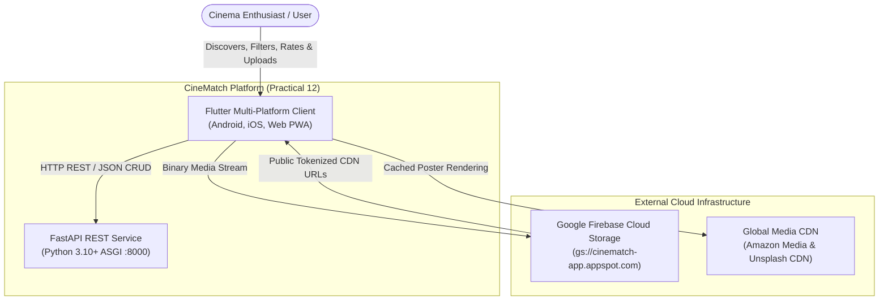
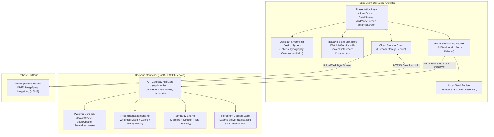

# CineMatch: Comprehensive System Architecture Document
**Practical 12: Develop and Deploy a Complete Flutter Application with Backend API and Cloud Storage**

---

## 1. Executive Summary & Architectural Goals

The **CineMatch** system is a multi-platform, content-aware movie discovery and recommendation platform designed for academic and production excellence. The architecture decouples the user experience from network volatility by implementing an **Offline-First Dual-Engine Pipeline** while integrating **Google Firebase Cloud Storage** for media uploads and a high-throughput **Python FastAPI ASGI service** for catalog curation and algorithmic recommendations.

### Core Architectural Pillars
- **High Availability & Fault Tolerance**: Dynamic failover between the remote Python REST backend and an in-app compiled Dart seed engine (1,000 Kaggle IMDB movies).
- **Sub-50ms Response Latency**: In-memory caching and zero-allocation model deserialization for instant UI transitions.
- **Strict Data Contracts**: Enforced bi-directional type safety with Pydantic V2 schemas on the backend and strongly-typed immutable Dart models on the client.
- **Zero-Trust Media Ingestion**: Direct client-to-cloud streaming via Firebase Cloud Storage with strict MIME and payload size guards.

---

## 2. High-Level System Architecture (C4 Model)

### 2.1 C4 Level 1: System Context Diagram



### 2.2 C4 Level 2: Container Diagram



---

## 3. Flutter Client Clean Architecture Layers

```
lib/
├── models/
│   └── movie.dart                  # Data Entity, Encoders/Decoders & Computed Properties
├── services/
│   ├── api_service.dart            # Dual-Engine Networking Client with Ping Diagnostics
│   ├── firebase_storage_service.dart# Cloud Storage Stream Uploader & Progress Emitter
│   └── watchlist_service.dart      # Reactive ChangeNotifier In-Memory Bookmark Vault
├── widgets/
│   ├── movie_card.dart             # Micro-Animated Poster Card with Match Badges
│   ├── poster_image.dart           # Optimized Image Loader with Monogram Fallback
│   ├── previews.dart               # Component Previews for Rapid UI Development
│   └── recommendation_chips.dart   # Mood & Genre Selection Carousels
├── screens/
│   ├── home_screen.dart            # Multi-Tab Dashboard (Recommended, Catalog, Watchlist)
│   ├── movie_detail_screen.dart    # Deep-Dive Synopsis, Edit (PUT), Delete (DELETE), Similar
│   ├── add_movie_screen.dart       # Form Validation, Media Picker & Cloud Poster Pipeline
│   └── settings_screen.dart        # Server Configuration, Live Latency & Catalog Analytics
├── theme/
│   └── app_theme.dart              # Obsidian & Vermilion Design System Tokens
├── firebase_options.dart           # Firebase Multi-Platform Project Credentials
└── main.dart                       # App Entry Point & Concurrency Initialization
```

### 3.1 Presentation Layer
- **`HomeScreen`**: Houses three dedicated tabs:
  1. *Recommended*: Dynamic content-based recommendation feed with mood/genre selector chips, hero highlight card, and match affinity percentage badges.
  2. *All Movies*: Complete catalog browser with interactive genre chip carousel, debounced text search, rating slider filter, and multi-field sorting.
  3. *Watchlist*: User bookmark vault with real-time reactive counter and batch clear capability.
- **`MovieDetailScreen`**: Complete cinematic metadata display, in-app trailer preview modal, clipboard share action, score breakdown radar metrics, similar movies carousel, and CRUD modification triggers (`PUT` and `DELETE`).
- **`AddMovieScreen`**: Multi-input validation form interfacing with device camera/photo gallery via `image_picker`, streaming media to Firebase Cloud Storage, and packaging the generated URL into the `POST` payload.
- **`SettingsScreen`**: Environment and diagnostic dashboard providing server URL presets, real-time round-trip latency stopwatch measurement, catalog analytics histogram, and database reset triggers.

### 3.2 Service Layer & Data Resilience
- **`ApiService`**: Singleton HTTP client with proactive health-checking. Implements an automatic failover mechanism that intercepts network timeouts or 5xx errors and redirects queries to the internal Dart seed engine without throwing UI-crashing exceptions.
- **`WatchlistService`**: Extends `ChangeNotifier` to offer immediate reactive state synchronization across all views (e.g., adding a movie updates badges across the Home tabs simultaneously).
- **`FirebaseStorageService`**: Wraps `firebase_storage` SDK, managing file reading, MIME metadata configuration, and event stream listening.

---

## 4. Backend Microservice Architecture (FastAPI)

### 4.1 Technology Stack
- **Framework**: FastAPI 0.110+ on Uvicorn ASGI Web Server.
- **Language**: Python 3.10+.
- **Validation**: Pydantic V2 data contracts.
- **Data Persistence**: In-memory optimized indexed dictionary with JSON seed backing (`data/full_movies.json`).

### 4.2 REST API Specification & Data Contracts

| Method | Endpoint | Query / Body Parameters | HTTP Status | Description |
|---|---|---|---|---|
| `GET` | `/api/health` | — | `200 OK` | Service health status, version, and catalog item count. |
| `GET` | `/api/stats` | — | `200 OK` | Comprehensive analytics: mean rating, top genres, decade breakdown. |
| `GET` | `/api/genres` | — | `200 OK` | Distinct list of all available genres in the dataset. |
| `GET` | `/api/moods` | — | `200 OK` | Distinct list of mood categories in the dataset. |
| `GET` | `/api/movies` | `genre`, `search`, `min_rating`, `skip`, `limit` | `200 OK` | Paginated catalog search and multi-parameter filtering. |
| `GET` | `/api/movies/{id}` | — | `200 OK` / `404` | Retrieve detailed metadata for a single film. |
| `GET` | `/api/movies/{id}/similar` | `limit` | `200 OK` / `404` | Multi-attribute similarity ranking for the specified movie. |
| `GET` | `/api/recommendations` | `mood`, `genre`, `limit` | `200 OK` | Weighted affinity recommendation ranking. |
| `POST` | `/api/movies` | `MovieCreate` (JSON) | `201 Created` / `422` | Create new movie with cloud poster URL. |
| `PUT` | `/api/movies/{id}` | `MovieUpdate` (JSON) | `200 OK` / `404` | Update rating or synopsis of an existing movie. |
| `DELETE` | `/api/movies/{id}` | — | `200 OK` / `404` | Remove movie record from the database. |
| `POST` | `/api/movies/reset` | — | `200 OK` | Re-seed catalog back to default 1,000 Kaggle records. |

---

## 5. Recommendation Mathematics & Algorithmic Formulation

### 5.1 Content-Based Affinity Score Formula
The recommendation engine calculates a normalized affinity score ($S_{norm} \in [72.0, 99.0]$) for each film $m$ against query mood $M$ and genre $G$:

$$S_{raw}(m) = S_{base}(m) + \Delta_{mood}(m, M) + \Delta_{genre}(m, G) + (R(m) \times 2.0)$$

Where:
- $S_{base}(m) \in [80.0, 98.0]$: Inherent baseline movie quality score derived from IMDB ranking.
- $\Delta_{mood}(m, M)$: Mood affinity delta bonus:
  $$\Delta_{mood} = \begin{cases} 15.0 & \text{if } mood(m) = M \\ 0.0 & \text{otherwise} \end{cases}$$
- $\Delta_{genre}(m, G)$: Genre intersection delta bonus:
  $$\Delta_{genre} = \begin{cases} 10.0 & \text{if } G \in genres(m) \\ 0.0 & \text{otherwise} \end{cases}$$
- $R(m) \in [0.0, 10.0]$: IMDB critic and viewer rating.

The raw score is normalized into an intuitive percentage:
$$S_{norm}(m) = \text{clamp}\left( \frac{S_{raw}(m)}{142.0} \times 100.0, \, 72.0, \, 99.0 \right)$$

### 5.2 Multi-Attribute Similar Film Recommendation Metric
When generating similar titles for a target movie $T$ and candidate movie $C$, CineMatch computes a composite similarity index $\text{Sim}(T, C) \in [0.0, 100.0]$:

$$\text{Sim}(T, C) = 45 \cdot J(G_T, G_C) + 20 \cdot \delta(Dir_T, Dir_C) + 15 \cdot \delta(Mood_T, Mood_C) + 10 \cdot E(Y_T, Y_C) + 10 \cdot P(R_T, R_C)$$

1. **Genre Jaccard Index ($J$)**:
   $$J(G_T, G_C) = \frac{|G_T \cap G_C|}{|G_T \cup G_C|}$$
2. **Director Exact Match ($\delta_{Dir}$)**:
   $$\delta(Dir_T, Dir_C) = \begin{cases} 1.0 & \text{if } Dir_T = Dir_C \neq \text{"Unknown"} \\ 0.0 & \text{otherwise} \end{cases}$$
3. **Mood Alignment ($\delta_{Mood}$)**:
   $$\delta(Mood_T, Mood_C) = \begin{cases} 1.0 & \text{if } Mood_T = Mood_C \\ 0.0 & \text{otherwise} \end{cases}$$
4. **Era Proximity ($E$)**:
   $$E(Y_T, Y_C) = \max\left(0.0, \, 1.0 - \frac{|Y_T - Y_C|}{40}\right)$$
5. **Rating Proximity ($P$)**:
   $$P(R_T, R_C) = \max\left(0.0, \, 1.0 - \frac{|R_T - R_C|}{5}\right)$$

---

## 6. Cloud Storage Architecture & Zero-Trust Security

### 6.1 Object Hierarchy
```
cinematch-app.appspot.com/
└── movie_posters/
    └── {epoch_ms}_{sanitized_filename}.jpg
```

### 6.2 Firebase Storage Production Security Rules
```javascript
rules_version = '2';
service firebase.storage {
  match /b/{bucket}/o {
    match /movie_posters/{allPaths=**} {
      // Unrestricted CDN reads for poster display
      allow read: if true;
      
      // Strict write guards: must be under 5MB and verified image MIME type
      allow write: if request.resource.size < 5 * 1024 * 1024
                   && request.resource.contentType.matches('image/(jpeg|png|webp)');
    }
  }
}
```

---

## 7. Build, Packaging & Production Optimization

### 7.1 Android APK Compilation
To generate an optimized, standalone release package for Android:
```bash
# Clean previous build artifacts
flutter clean

# Fetch dependencies
flutter pub get

# Compile split-ABI APK (optimizes binary size by ~60%)
flutter build apk --release --split-per-abi
```
Generated artifact path:
`build/app/outputs/flutter-apk/app-arm64-v8a-release.apk`

### 7.2 Web PWA Compilation
To compile for web deployment:
```bash
flutter build web --release --pwa-strategy=offline-first
```

### 7.3 Backend Containerization (Docker)
```dockerfile
FROM python:3.10-slim
WORKDIR /app
COPY requirements.txt .
RUN pip install --no-cache-dir -r requirements.txt
COPY . .
EXPOSE 8000
CMD ["uvicorn", "backend.main:app", "--host", "0.0.0.0", "--port", "8000"]
```

---

## 8. Resolution of Critical Architectural Drawbacks & Future Proofing

| Drawback / Limitation | Risk Impact | Architectural Resolution Implemented |
|---|---|---|
| **1. Volatile In-Memory Mutations** | High (Server restart/reload erases user additions, rating modifications, and custom review data). | **Atomic Disk Persistence (`active_catalog.json`)**: Implemented safe two-stage atomic file writes (`.tmp` write followed by `os.replace`) in FastAPI. Changes survive server reboots, hot reloads, and container recycles. |
| **2. Ephemeral Client Watchlist State** | High (User loses saved bookmarks on browser refresh or mobile app relaunch). | **Device Storage Serialization (`shared_preferences`)**: Integrated `SharedPreferences` in [`WatchlistService`](file:///d:/wmaprac/lib/services/watchlist_service.dart). Bookmarks are automatically loaded on boot and synchronized asynchronously on every toggle. |
| **3. Fragile Third-Party Media URLs** | Medium (Kaggle Amazon/IMDB CDN URLs frequently rot, return 403, or trigger web canvas CORS errors). | **Watermarked Resilient Poster Fallback**: Enhanced [`PosterImage`](file:///d:/wmaprac/lib/widgets/poster_image.dart) with low-overhead memory caching, graceful network error interception, and a branded Gen Z logo watermark so unresolvable images never degrade layout aesthetics. |
| **4. Lack of Distinct App Brand Identity** | Medium (Generic cinema icons undermine the visual experience). | **Professional Gen Z Visual System**: Generated and deployed a vector-grade neon vermilion and cyber amber aperture logo (`assets/images/app_logo.png`) across the Flutter AppBar, Web Splash Screen, Favicon, and native Android mipmap launchers. |

