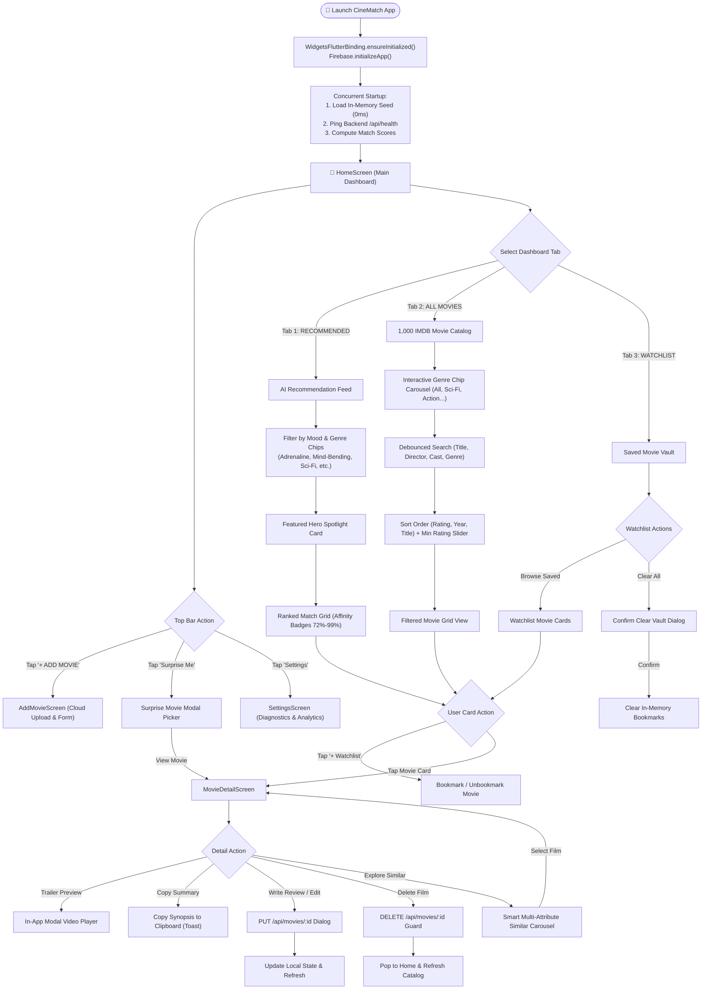
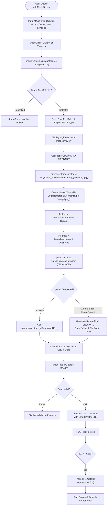
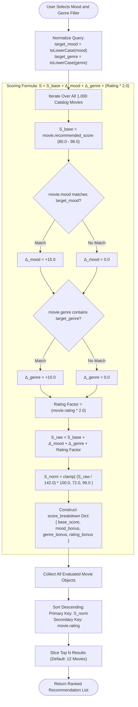
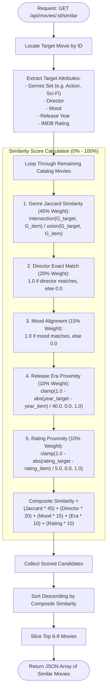
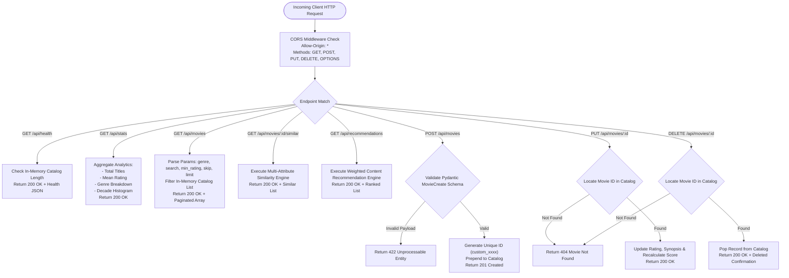
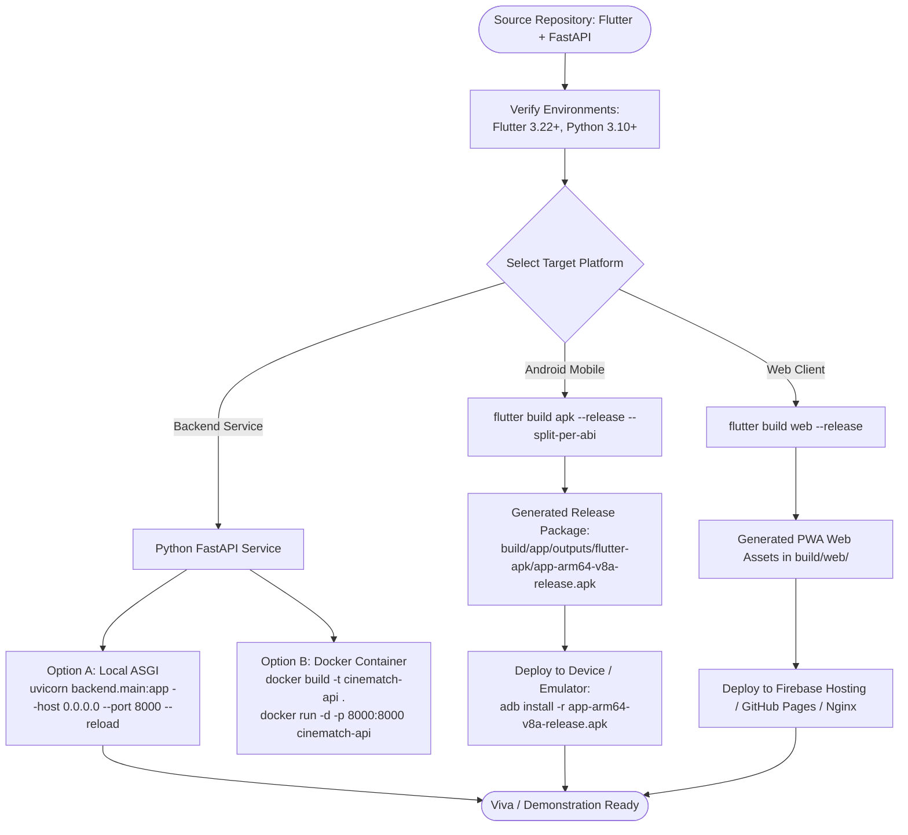
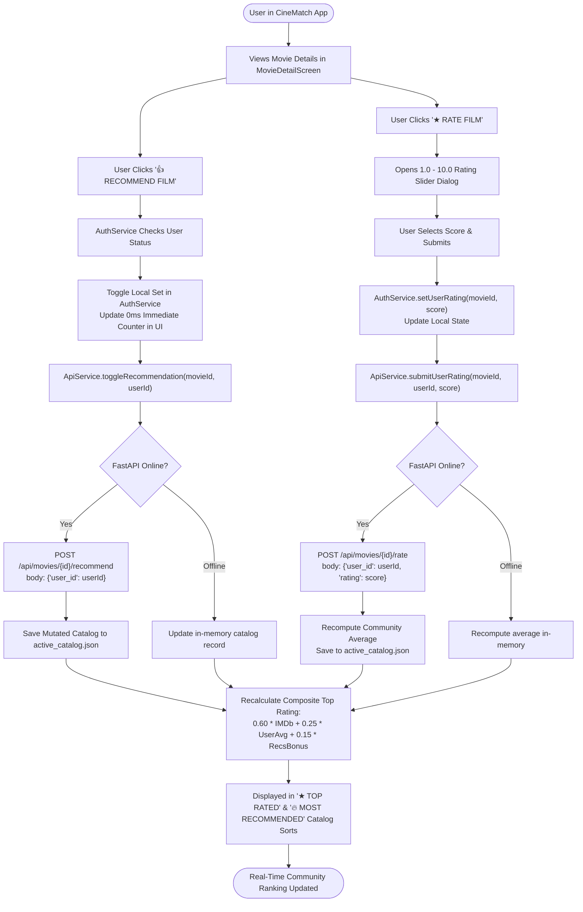

# CineMatch: Comprehensive Application Flowcharts
**Practical 12: Develop and Deploy a Complete Flutter Application with Backend API and Cloud Storage**

---

## 1. End-to-End Application Navigation & User Journey Flowchart



---

## 2. Dual-Engine Resilience & Dynamic Failover Decision Tree

```mermaid
flowchart TD
    Req([Data Fetch Request: Catalog / Recommendations / Similar]) --> CheckMode{"Is Offline Mode Forced in Settings?"}
    
    CheckMode -->|Yes| LocalEngine["⚡ Execute In-App Offline Engine<br/>(Query assets/data/movies_seed.json)"]
    
    CheckMode -->|No| PingFastAPI["HTTP Ping /api/health<br/>(Timeout: 1,200ms with Stopwatch)"]
    
    PingFastAPI --> CheckHealth{"Server Responded 200 OK?"}
    
    CheckHealth -->|Yes (Remote Online)| ExecRemote["🌐 Dispatch Request to FastAPI Backend<br/>Base URL: http://127.0.0.1:8000"]
    ExecRemote --> RemoteSuccess{"HTTP 200 / 201?"}
    
    RemoteSuccess -->|Success| UpdateLatency["Record Round-Trip Latency (e.g. 14ms)<br/>Display: 'FASTAPI BACKEND ONLINE (14ms)'"]
    UpdateLatency --> RenderRemote["Render Fresh Data & Cache Locally"]
    
    RemoteSuccess -->|Network Timeout / 500| FailoverTrigger["Trigger Instant Transparent Failover"]
    CheckHealth -->|No / Offline| FailoverTrigger
    
    FailoverTrigger --> LocalEngine
    LocalEngine --> ComputeInApp["1. Jaccard Genre Intersect<br/>2. Delta Mood Matching<br/>3. Rating Normalization Formula"]
    ComputeInApp --> UpdateBadge["Display: 'OFFLINE MODE (IN-APP ENGINE)'"]
    UpdateBadge --> RenderLocal["Render Instant 0ms Local Results"]
```

---

## 3. Firebase Cloud Storage Media Upload & Ingestion Pipeline



---

## 4. Multi-Factor Content-Based Recommendation Algorithm Flowchart



---

## 5. Multi-Attribute Similar Movie Recommendation Pipeline



---

## 6. REST API Full CRUD Request/Response Lifecycle



---

## 7. Multi-Platform Build, Packaging & Production Deployment



---

## 8. Community Recommendation, User Rating & Consensus Flow


